# 💽 Drive Intaker

[](https://www.python.org/)
[](https://fastapi.tiangolo.com/)
[](https://podman.io/)
[](https://www.proxmox.com/)
[](tests/)
[](LICENSE)

> **A self-contained Podman web application with a modern dark GUI for safely inspecting, wiping, testing, firmware checking, stress-verifying, benchmarking, and grading enterprise SATA, SAS, and NVMe SSDs one drive at a time on Proxmox VE.**

---

## 📑 Table of Contents

- [Overview](#-overview)
- [Key Features](#-key-features)
- [Intake Workflow Pipeline](#-intake-workflow-pipeline)
- [Safety Architecture & Protections](#-safety-architecture--protections)
- [Zero-Host Data Footprint](#-zero-host-data-footprint)
- [Quick Start](#-quick-start)
  - [Method 1: Standalone Podman (Recommended)](#method-1-standalone-podman-recommended)
  - [Method 2: Podman Quadlet (Systemd Managed)](#method-2-podman-quadlet-systemd-managed)
  - [Accessing the GUI](#accessing-the-web-gui)
- [Grading & Qualification Schema](#-grading--qualification-schema)
- [REST API Endpoints](#-rest-api-endpoints)
- [Development & Automated Testing](#-development--automated-testing)
- [Project Structure](#-project-structure)

---

## 🔍 Overview

Enterprise SSDs pulled from decommissioned servers, eBay lots, or lab clusters need rigorous qualification before being trusted in production ZFS pools or Ceph clusters. 

**Drive Intaker** packages the industry-standard qualification methodology into an easy-to-use, web-based intake console that runs directly on your Proxmox VE host inside an isolated Podman container.

```mermaid
flowchart LR
    A["🔌 Insert SSD"] --> B["🔎 Auto-Discovery & Health Snapshot"]
    B --> C["🛡️ Pre-Flight Safety Checks"]
    C --> D["🧹 Secure Wipe / Sanitize"]
    D --> E["⚡ SMART Self-Tests"]
    E --> F["📦 fwupd Firmware Check"]
    F --> G["💾 100% Write + CRC32C Verification"]
    G --> H["📈 Fio Storage Benchmarks"]
    H --> I["📊 Comprehensive REPORT.md & Grade"]
```



---

## ✨ Key Features

- **🛡️ Uncompromising Safety Engine**: Automatic parent disk detection protects Proxmox boot/system drives (`/`, `/boot`, `/boot/efi`, LVM root volume groups, and ZFS root pools).
- **🔒 Persistent User Disk Locking**: Permanently lock secondary, pool, or backup disks from the GUI to permanently forbid all destructive operations.
- **⚡ Modular Intake Modes**:
  - **Regular Intake Pipeline**: Complete end-to-end qualification (Wipe &rarr; SMART Short &rarr; fwupd &rarr; 100% Write + CRC Verify &rarr; Benchmarks &rarr; Report).
  - **⚡ SMART Short Self-Test Only (~5m)**: Standalone, non-destructive quick health verification.
  - **⚡ SMART Extended Self-Test Only (~60m)**: Standalone, non-destructive deep surface & sector scan.
  - **🛡️ Safe Inventory Mode**: Non-destructive baseline snapshot and firmware availability query.
  - **⚙️ Custom Workflows**: Toggle individual verification stages as needed.
- **📡 Real-Time SSE Log Streaming**: Live terminal output streamed line-by-line via Server-Sent Events (SSE) with interactive stage progress indicators.
- **📦 Zero-Host Footprint**: All reports, registries, and diagnostic logs live **strictly inside the container storage**. Zero residual files are written to the physical Proxmox host.
- **🏷️ Interactive Grading & Review**: Classify drives (`PASS-A`, `PASS-B`, `MONITOR`, `REJECT`, `WIPED-ONLY`) directly in the UI and add technician notes to persistent Markdown reports.
- **🧹 Instant Log Purge**: Single-click purge option in the GUI and REST API to delete all historical logs and reports.
- **🔌 Enterprise Controller Support**: Inspects raw ATA/SCSI/NVMe registers via `smartctl -x`, `hdparm -I`, `udevadm`, `lsscsi`, and `lsblk`.

---

## 🔄 Intake Workflow Pipeline

When executing the **Regular Intake Pipeline**, Drive Intaker runs through 8 distinct stages:

```
[1. INITIAL_INVENTORY]  ──► [2. SAFETY_CHECKS]   ──► [3. BEFORE_SNAPSHOT]
                                                             │
[6. FULL_VERIFY]        ◄── [5. FIRMWARE_CHECK]  ◄── [4. WIPE & SHORT SMART]
       │
       ▼
[7. BENCHMARKS]         ──► [8. AFTER_SNAPSHOT & REPORT GENERATION]
```

1. **Initial Inventory**: Queries device topology, model, serial, capacity, transport (SATA/SAS/NVMe), and baseline controller properties.
2. **Safety Checks**: Validates whole-disk status, ensures the disk is not mounted, swap-active, LVM-active, ZFS-active, or user-locked, and confirms serial match.
3. **Before Snapshot**: Records baseline SMART metrics (Power-On Hours, Wear Percentage, Reallocated Sectors, CRC Errors, Temperature, TBW).
4. **Secure Wipe & SMART Short**: Erases drive partitions/signatures (`blkdiscard` / `hdparm --security-erase` / `nvme format`) and executes a ~5-minute internal drive self-test.
5. **Firmware Review**: Runs `fwupdmgr` to check device updatability and flag firmware updates (automatic flashing is disabled for OEM safety).
6. **Full-Disk Write + CRC32C Verify**: Performs a 100% full-capacity sequential pattern write followed by a 100% full-capacity read verification pass using `fio` with CRC32C verification blocks.
7. **Performance Benchmarks**: Executes standardized sequential read/write and 4K random mixed (70/30) IOPS benchmarks.
8. **After Snapshot & Report**: Captures final post-stress SMART state, calculates metric diffs (verifying zero reallocated sectors appeared during stress), and generates `REPORT.md` and `run.json`.

---

## 🛡️ Safety Architecture & Protections

| Protection | Implementation |
| :--- | :--- |
| **Proxmox Boot Disk Protection** | Auto-detects physical disks backing `/`, `/boot`, `/boot/efi`, LVM PVs, and ZFS root pools (`/dev/nvme0n1`). |
| **Permanent Disk Lock** | Administrators can lock any disk (`🔒 Lock Disk`). The lock persists in container storage and permanently forbids data destruction. |
| **Whole Disks Only** | Partitions (`/dev/sda1`, `/dev/nvme0n1p1`) and virtual loop devices are strictly rejected. |
| **In-Use Disk Prevention** | Refuses any disk with active mounts, active swap, LVM volume memberships, ZFS pool memberships, or RAID holders. |
| **Serial Confirmation** | Destructive actions require typing the exact drive serial number before execution. |
| **Single-Job Concurrency** | Hardware locking prevents multiple destructive jobs from running simultaneously. |

*For complete threat models and design details, see [SAFETY.md](SAFETY.md).*

---

## 📦 Zero-Host Data Footprint

All intake data, diagnostic outputs, and logs are stored **strictly within the container storage** (or named container volume `ssd-intake-data`). 

- No files or directories are created on the physical host machine.
- Clicking **"Delete All Logs & Reports"** in the GUI completely clears stored run records.
- Removing the container leaves your Proxmox VE host 100% clean.

---

## 🚀 Quick Start

### Prerequisites
Install Podman on your Proxmox host:
```bash
apt update && apt install -y podman
```

---

### Method 1: Standalone Podman (Recommended)

#### 1. Clone & Build
```bash
git clone https://github.com/Eowerd24/Drive-Intaker.git
cd Drive-Intaker
podman build -t ssd-intake:latest .
```

#### 2. Launch Container
```bash
sudo podman run -d --name ssd-intake \
    --privileged \
    -p 127.0.0.1:7492:7492 \
    -v ssd-intake-data:/app/reports:Z \
    -v /dev:/dev \
    -v /sys:/sys:ro \
    -v /run/udev:/run/udev:ro \
    -v /proc:/proc:ro \
    -e SSD_INTAKE_HOST=0.0.0.0 \
    -e SSD_INTAKE_PORT=7492 \
    -e SSD_INTAKE_ROOT_DIR=/app/reports \
    localhost/ssd-intake:latest
```

---

### Method 2: Podman Quadlet (Systemd Managed)

Deploy as a native systemd unit managed by Proxmox:

```bash
# 1. Copy Quadlet container definition
cp deploy/ssd-intake.container /etc/containers/systemd/ssd-intake.container

# 2. Reload systemd
systemctl daemon-reload

# 3. Start the service
systemctl start ssd-intake
systemctl enable ssd-intake
```

---

### 🌐 Accessing the Web GUI

For security, the application binds locally to port `7492`. Access the GUI from your workstation via SSH port forwarding:

```bash
ssh -L 7492:127.0.0.1:7492 root@<proxmox-ip>
```

Open your browser and navigate to:
👉 **[http://localhost:7492](http://localhost:7492)**

| Page | URL | Description |
| :--- | :--- | :--- |
| **Dashboard** | `http://localhost:7492/` | Discovered disks, eligibility overview, system status |
| **Drive Details** | `http://localhost:7492/drives/{name}` | Hardware specs, raw diagnostics (`smartctl -x`, `hdparm -I`), Lock Disk, Short & Long SMART buttons |
| **Intake Setup** | `http://localhost:7492/intake` | Workflow selection, custom toggles, serial confirmation |
| **Live Job Console** | `http://localhost:7492/jobs/current` | Real-time terminal SSE log streaming and stage progress |
| **Reports Archive** | `http://localhost:7492/reports` | Historical intake records, grading, report delete & purge |

---

## 🏆 Grading & Qualification Schema

Each processed SSD can be classified directly in the web UI after reviewing the generated `REPORT.md`:

| Classification | Meaning | Criteria |
| :--- | :--- | :--- |
| **`PASS-A`** | Production Grade | 100% CRC verification pass, 0 bad sectors, &ge;90% endurance remaining, full benchmark performance. Suitable for primary storage / hypervisor pools. |
| **`PASS-B`** | Secondary / Lab Grade | Passed verification, 0 bad sectors, 70–89% wear remaining or minor cosmetic caveats. Suitable for secondary storage, dev VMs, or scratch pools. |
| **`MONITOR`** | Watchlist | Minor recoverable interface errors, high power-on hours (&gt;40,000 hrs), or wear &lt;70%. |
| **`REJECT`** | Failed / Unusable | SMART health failure, uncorrectable read/write errors during full CRC verify, or bad sectors detected during testing. Must not be placed in service. |
| **`WIPED-ONLY`** | Sanitized | Securely wiped and short-tested; pending full stress verification. |

---

## 🔌 REST API Endpoints

| Method | Endpoint | Description |
| :--- | :--- | :--- |
| `GET` | `/api/system` | Host information, protected system disks, storage config |
| `GET` | `/api/drives` | Discovers and inspects all block storage devices |
| `GET` | `/api/drives/{name}` | Detailed metadata and raw diagnostics for a specific drive |
| `POST` | `/api/drives/{name}/lock` | Permanently locks a disk against all data destruction |
| `POST` | `/api/jobs` | Starts an intake workflow job |
| `GET` | `/api/jobs/current` | Status of the active intake job |
| `POST` | `/api/jobs/cancel` | Gracefully terminates the running job |
| `GET` | `/api/jobs/stream` | Server-Sent Events (SSE) log and stage stream |
| `GET` | `/api/reports` | Lists all historical intake reports |
| `GET` | `/api/reports/{run_id}` | JSON metadata for a specific run record |
| `POST` | `/api/reports/{run_id}/classify` | Updates report classification grade and technician notes |
| `DELETE`| `/api/reports/{run_id}` | Deletes a single intake report and diagnostic folder |
| `POST` | `/api/reports/purge` | Permanently deletes all historical reports and logs |

---

## 🧪 Development & Automated Testing

Drive Intaker includes a comprehensive test suite covering safety validation, mock storage tools, report parsing, and API routes:

```bash
# Set up virtual environment
python3 -m venv .venv
source .venv/bin/activate
pip install -r requirements.txt

# Run pytest suite
pytest -v
```

All 35 unit and integration tests run in mock mode without requiring physical test SSDs or root privileges.

---

## 📂 Project Structure

```text
Drive-Intaker/
├── Containerfile             # Rootful Podman container build definition
├── entrypoint.sh             # Container runtime entrypoint & startup banner
├── requirements.txt          # Python dependencies (FastAPI, Uvicorn, Jinja2, Pydantic, pytest)
├── SAFETY.md                 # Security model, threat analysis & safety invariants
├── app/
│   ├── config.py             # App settings (ports, storage directories, system overrides)
│   ├── main.py               # FastAPI application, route handlers & SSE streaming
│   ├── core/
│   │   ├── disk_detector.py  # Discovers block storage devices & enriches metadata
│   │   ├── safety.py         # Strict safety validator, boot disk detector & disk locking
│   │   ├── runner.py         # Subprocess runner & asynchronous line-by-line logger
│   │   ├── smart_parser.py   # SATA/NVMe SMART parsing & before/after health diff engine
│   │   ├── firmware.py       # fwupd integration (Updatable vs Update Available checking)
│   │   ├── fio_runner.py     # Full write + CRC32C verify & fio performance workloads
│   │   ├── reporter.py       # Report generator (REPORT.md, run.json, delete & purge)
│   │   └── intake_job.py     # State machine coordinator for intake workflows
│   ├── templates/            # Jinja2 HTML templates (Dashboard, Details, Intake, Progress, Reports)
│   └── static/               # Dark homelab CSS stylesheet & vanilla JavaScript
├── deploy/
│   ├── ssd-intake.container  # Podman Quadlet systemd definition
│   ├── ssd-intake.service    # Standard systemd service file
│   └── ssd-intake.env.example# Example environment configuration template
└── tests/                    # Automated pytest verification test suite
```

---

## 📜 License

MIT License. See [LICENSE](LICENSE) for details.
