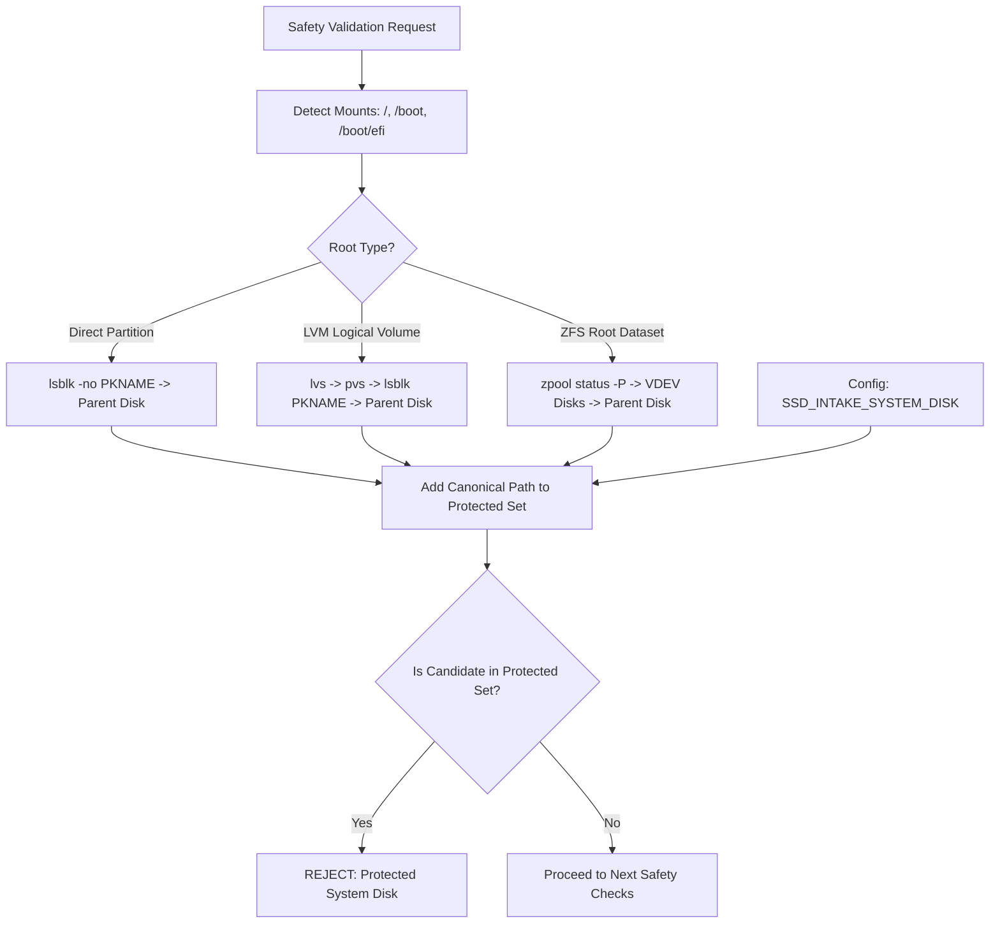

# Safety Architecture & Threat Model

The **Proxmox SSD Intake Station** is designed to perform low-level hardware inspection, destructive erasure, SMART diagnostics, and stress verification on used enterprise SSDs. Because these operations are destructive, the software enforces multiple layered defenses to protect the host Proxmox environment.

---

## 1. Core Invariants & Safety Guarantees

1. **The Proxmox host system/boot disk can NEVER be targeted**:
   - The application automatically discovers the parent physical disk backing `/`, `/boot`, `/boot/efi`, LVM Volume Groups, and ZFS pools.
   - An explicit system disk override can also be provided in configuration.
   - Any attempt to target a protected disk immediately fails both client-side and server-side with an unbypassable safety exception.

2. **Whole Disks Only (Partitions strictly forbidden)**:
   - Destructive operations only target whole physical block devices (e.g. `/dev/sdb`, `/dev/nvme1n1`).
   - Partition nodes (e.g. `/dev/sda1`, `/dev/nvme0n1p3`) and virtual loop devices are strictly rejected.

3. **In-Use Disks are Refused**:
   - Any disk with active mount points on the host is refused.
   - Any disk with active swap space is refused.
   - Any disk acting as an active LVM Physical Volume (PV) is refused.
   - Any disk referenced by an active ZFS pool is refused.
   - Any disk with active device-mapper holders or software RAID arrays is refused.

4. **Strict Device Path Allowlist**:
   - The backend validates candidate paths against currently detected whole block devices.
   - Path traversals (e.g. `../../etc/shadow`), character devices (`/dev/mem`, `/dev/null`), and arbitrary command injections are rejected with HTTP 400 Bad Request.

5. **Mandatory Serial Number Confirmation**:
   - All destructive workflows (Wipe, Write Verification, Benchmarks) require typing the exact serial number of the candidate SSD.
   - Client-side buttons remain disabled until the serial matches.
   - Server-side validates the serial string against the actual drive hardware before any destructive action is executed.

6. **Persistent User Disk Locking (Permanent Protection)**:
   - Administrators can permanently **Lock** any drive via the GUI (`🔒 Lock Disk`).
   - The lock state is saved persistently inside container storage (`locked_disks.json`).
   - Once locked, any operation touching data destruction (Wipe, Write Verification, Benchmarks) is permanently blocked by the safety validator and API.
   - Only non-destructive inspections and SMART tests are permitted.

7. **Single-Job Concurrency Guard**:
   - Only one intake job can execute at any given time.
   - Concurrent job attempts are rejected with HTTP 409 Conflict.

---

## 2. System Disk Detection Mechanics

Proxmox installations frequently use non-trivial storage layouts (LVM on top of partitions, ZFS root pools, or separate boot/EFI partitions). The `SafetyValidator` resolves physical parent disks through:



---

## 3. Firmware Safety Model

Enterprise SSDs (e.g. Samsung SM863/PM863/PM883, Micron 5200/5300, Intel/Solidigm D3) often carry OEM-specific firmware (Dell, HPE, Lenovo) even when the underlying hardware is identical to retail models.

- **`Updatable` vs `Update Available`**:
  - `Updatable` means `fwupd` has a plugin capable of communicating with this hardware type. It does **not** mean an update exists.
  - `Update Available` means an enabled remote (LVFS or OEM) offers a newer firmware binary.
- **Zero Automatic Flashing**:
  - Version 1.1.0 of this tool strictly records and displays firmware availability.
  - If a firmware update is discovered, the drive is prominently marked:
    > `Firmware update available — manual review required`
  - Automatic flashing is intentionally disabled to avoid bricking OEM drives with generic firmware payloads.

---

## 4. Hardware Access, Permissions & Least-Privilege Execution Model

### Why Low-Level Storage Access is Required

Unlike standard web applications, a storage intake station interacts directly with raw kernel block devices and storage controller buses:

1. **SCSI/ATA/NVMe Pass-Through (`SG_IO` ioctls)**:
   - `smartctl` requires raw SCSI/ATA command pass-through (`CAP_SYS_RAWIO`) to query low-level drive health and initiate firmware-level self-tests.
2. **Direct Block I/O (`fio`)**:
   - Destructive full-drive write and CRC verification requires opening `/dev/sdX` with `O_DIRECT` and writing to raw sectors.
3. **Partition & Metadata Erasure**:
   - `sgdisk`, `wipefs`, and kernel partition table rereads (`partprobe`, `blockdev --rereadpt`) require partition management capabilities (`CAP_SYS_ADMIN`).
4. **Host Mount & Topology Inspection**:
   - To guarantee that mounted filesystems, active LVM PVs, and ZFS pools are not touched, the system inspects host block status and mounts (`pvs`, `lvs`, `zpool`).

### Safe Execution Modes (Resolving Root/Permission Friction)

To prevent file permission conflicts on the host while maintaining the Principle of Least Privilege, three safe execution architectures are supported:

#### Option A: Containerized Execution with Granular Capabilities (Recommended for Production)
- Avoid running containers with unrestricted host access. Use fine-grained Linux capabilities:
  ```bash
  podman run -d --name ssd-intake \
      --cap-add=CAP_SYS_RAWIO \
      --cap-add=CAP_SYS_ADMIN \
      --userns=keep-id \
      -v /dev:/dev:rslave \
      -v /run/udev:/run/udev:ro \
      -v /sys:/sys:ro \
      -v ssd-intake-data:/app/reports:Z \
      -p 127.0.0.1:7492:7492 \
      localhost/ssd-intake:latest
  ```
- **`--userns=keep-id`**: Ensures files written to host mounts are owned by your host user (not `root:root`).
- **Named Volume (`ssd-intake-data`)**: Isolates internal reports so host directories are not polluted with root-owned files.

#### Option B: Bare-Metal / Host Service with Sudoers Whitelist (Least-Privilege Host Mode)
- Run the FastAPI web server as an unprivileged service user (`ssd-intake` or your local user).
- Install the provided drop-in rule in `/etc/sudoers.d/ssd-intake` ([deploy/ssd-intake.sudoers](file:///home/sarge/Backrooms/Dev%20drive/Active%20Development/SSD%20Health%20Check/deploy/ssd-intake.sudoers)).
- Set `SSD_INTAKE_USE_SUDO=1` in your environment or systemd unit. The runner will automatically prepend `sudo -n` strictly for the authorized storage binaries.

### Security Controls & Best Practices

- **Local Bind Only**: The web server binds to `127.0.0.1:7492` by default.
- **Dedicated Administration Use**: Access the GUI via SSH port forwarding (`ssh -L 7492:localhost:7492 root@proxmox`) or internal management network.
- **Zero Shell Injection**: Subprocesses are executed using argument arrays (`list[str]`), never `shell=True`.
- **Readable Artifact Permissions**: Run directories and reports are generated with `0755` / `0644` modes so non-root operators can inspect and manage reports.

---

## 5. Cancellation & Partial State Handling

If a destructive job is cancelled while in progress:
- Running `fio` or `smartctl` processes are cleanly terminated via `SIGTERM` (escalating to `SIGKILL` if unresponsive).
- The drive status is marked as `CANCELLED`.
- A warning is recorded in the report explaining that the disk may be in a partially written or wiped state.

---

## 6. Container Data Isolation (Zero Footprint on Physical Host)

All reports, logs, and diagnostic traces are stored **strictly inside the container filesystem** (or within a container volume).
- **Physical Host Cleanliness**: The application does not write data folders or leave residual log artifacts on the physical host machine filesystem outside the container.
- **Log Purge & Wipe**: The GUI provides a dedicated "Delete All Logs & Reports" option to clear all stored history with a single action.
- **Complete Erasure**: Removing or resetting the Podman container removes all stored reports cleanly from the system.
